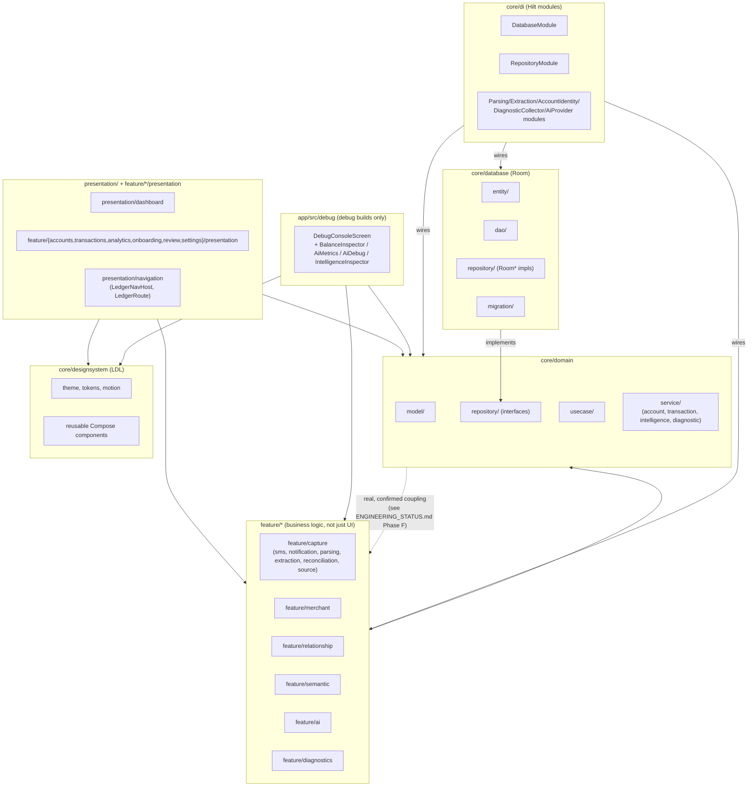
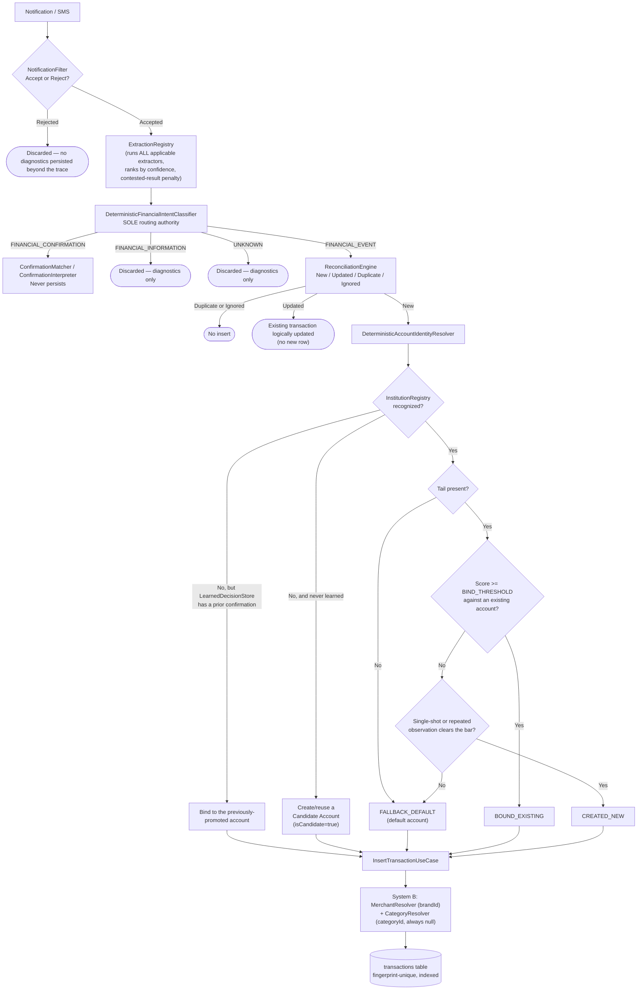
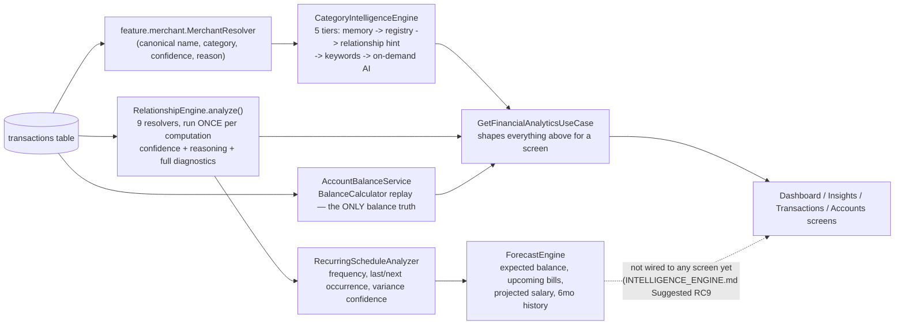
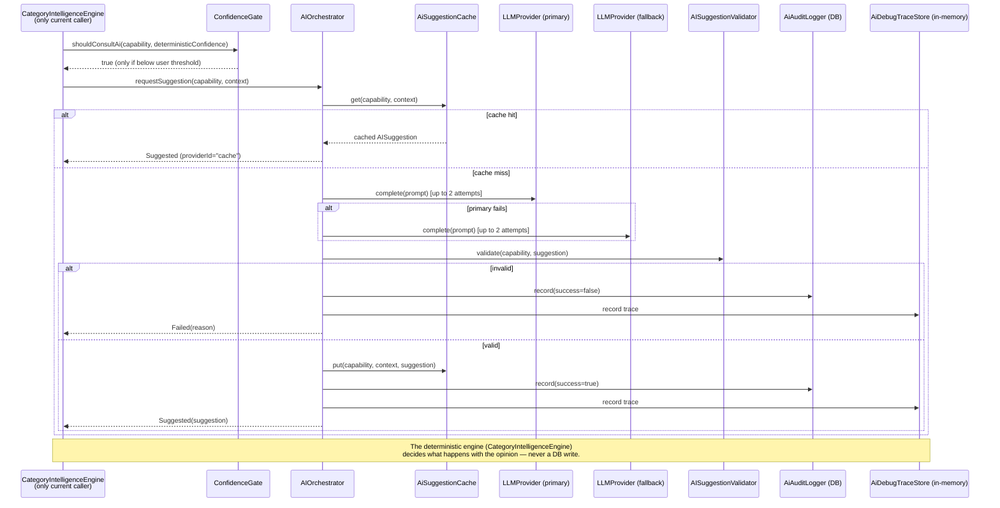
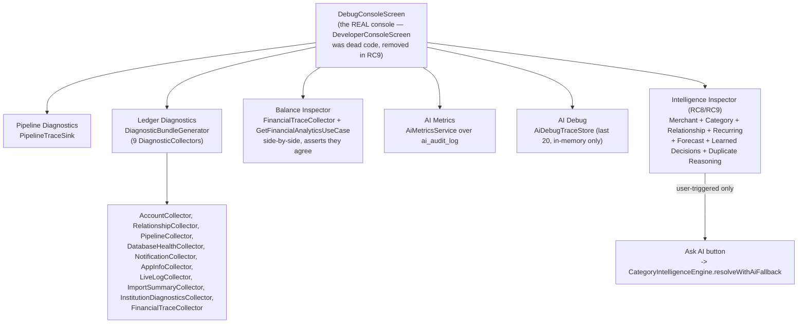
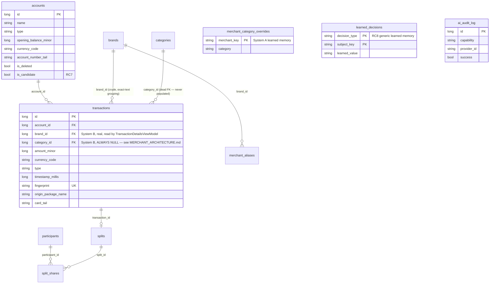
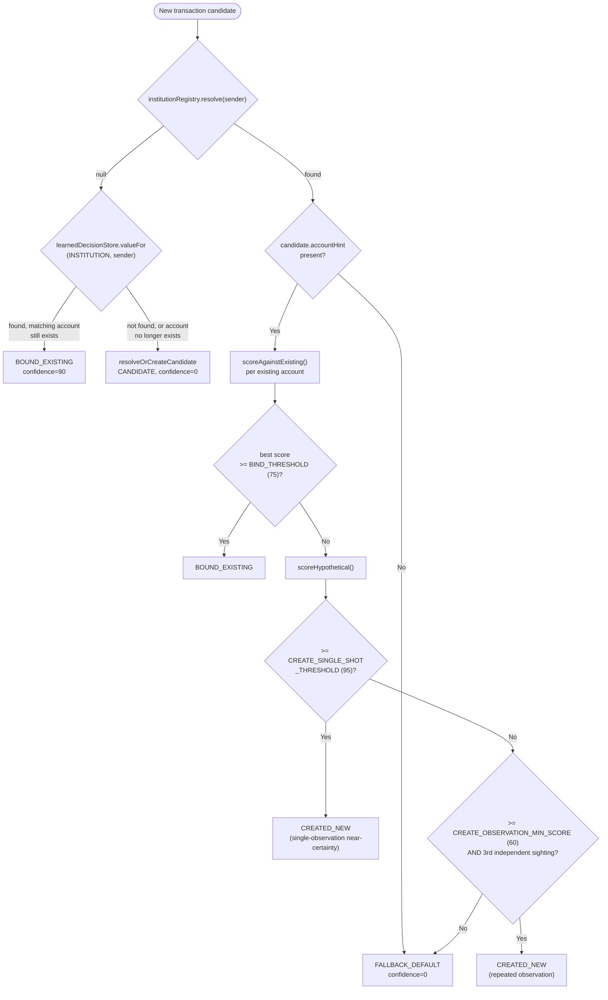

# Ledger — Visual Architecture

RC9. Companion to `FINANCIAL_ENGINE.md`, `INTELLIGENCE_ENGINE.md`,
`PIPELINE_ARCHITECTURE.md`, `MERCHANT_ARCHITECTURE.md`, and
`ENGINEERING_STATUS.md` — this document is the visual index into all of them.
Every diagram below reflects the REAL, current code (verified while writing
each companion doc), not an aspirational design.

## 1. Package architecture

**The dotted line is real, not a mistake.** `core/domain` importing from
`feature/*` (e.g. `AccountBalanceService` importing `feature.relationship.RelationshipEngine`,
`DeterministicAccountIdentityResolver` importing `feature.capture.notification.NotificationEnvelope`)
is a confirmed, pervasive, and — per `ENGINEERING_STATUS.md`'s Phase F
findings — an accepted architectural characteristic of this codebase, not a
bug introduced by any single RC. `feature/*` here means "shared domain-adjacent
services" (relationship inference, merchant intelligence, capture pipeline),
not "UI screens" — the actual UI-only code lives in `feature/*/presentation`
and `presentation/*`, which is a one-way dependency into `core/domain`/`feature/*`
as expected.

## 2. Live capture pipeline (every SMS/notification)

## 3. Read-time intelligence pipeline (never runs during capture)

## 4. AI Orchestration (advisory-only, never a write path)

## 5. Developer Console — Explainability surface (RC5-RC9)

## 6. Database schema (Room, version 10)

**`category_id`'s FK to `categories` is real but permanently unpopulated** —
confirmed in `MERCHANT_ARCHITECTURE.md`. This is why RC9 did NOT drop the
`categories` table when removing its dead application-layer wrapper
(`CategoryRepository`/`RoomCategoryRepository`/domain `Category` model) —
the table itself is still a live FK target.

## 7. Account Resolution decision surface (RC7/RC8, detailed)

## Cross-reference

| Doc | Covers |
|---|---|
| `FINANCIAL_ENGINE.md` | Institution Registry, Account Resolver, Currency Rules, Balance Calculation, Reconciliation, AI Boundaries |
| `INTELLIGENCE_ENGINE.md` | Merchant/Learning/Category/Relationship/Recurring/Duplicate/Forecast engines, Confidence Model, Decision Hierarchy |
| `MERCHANT_ARCHITECTURE.md` | The System A vs System B investigation and merge decision (diagram 6 above) |
| `PIPELINE_ARCHITECTURE.md` | Stage-by-stage input/output/confidence/reason/fallback/AI/failure-mode audit (diagrams 2-3 above) |
| `ENGINEERING_STATUS.md` | Technical debt, frozen systems, dependency findings, performance findings, product-readiness scorecard |
